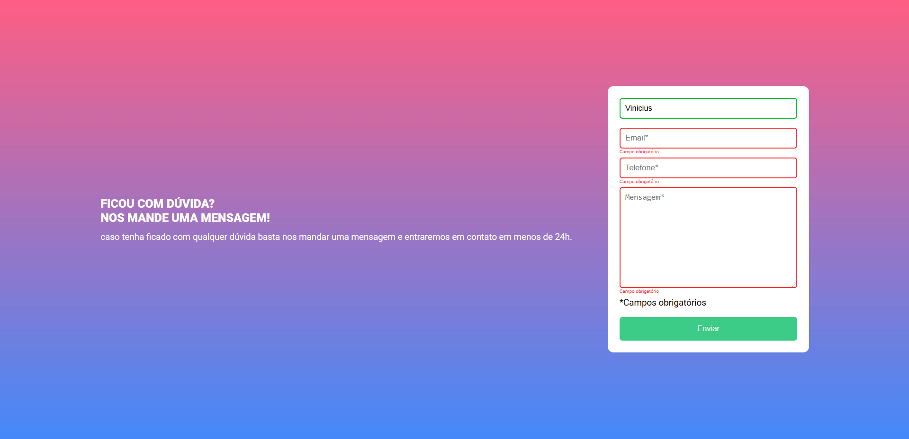

# Form validation | Javascript intermediario quest

This is a solution to the Javascript intermediary quest by DevQuest Course

## Table of contents

- [Overview](#overview)
  - [The challenge](#the-challenge)
  - [Screenshot](#screenshot)
  - [Links](#links)
- [My process](#my-process)
  - [Built with](#built-with)
  - [What I learned](#what-i-learned)
  - [Continued development](#continued-development)
  - [Useful resources](#useful-resources)
- [Author](#author)
- [Acknowledgments](#acknowledgments)

## Overview

### The challenge

Users should be able to:

- View the optimal layout depending on their device's screen size
- Indicates if any inputs are incorrect
- Show if there are any inputs to fill when submiting

### Screenshot

- Desktop version

- Mobile version

### Links

- Live Site URL: [Live site at GitHub-Pages](https://viniciusmontibeller.github.io/form-validation-quest/)

## My process

### Built with

- Semantic HTML5 markup
- CSS custom properties
- Flexbox
- Javascript

### What I learned

In this project i learned how to perform a basic form validation with Javascript

### Continued development

With this project i realised how to better work if DOM elements and that there´s much more to learn about it.

## Useful resources

 - [W3Schools](https://www.w3schools.com/)
 - [MDN Web Docs](https://developer.mozilla.org/en-US/)
 - [Dev em Dobro](https://github.com/devemdobro)

## Autor
 - Github - [viniciusmontibeller](https://github.com/viniciusmontibeller)

 ## Acknowledgments

I got to say that i'm really happy to be studying with the lessons by [Dev em Dobro](https://github.com/devemdobro). I started with zero programing skills and now i can see that i'm growing little by little into what i wanted to be.